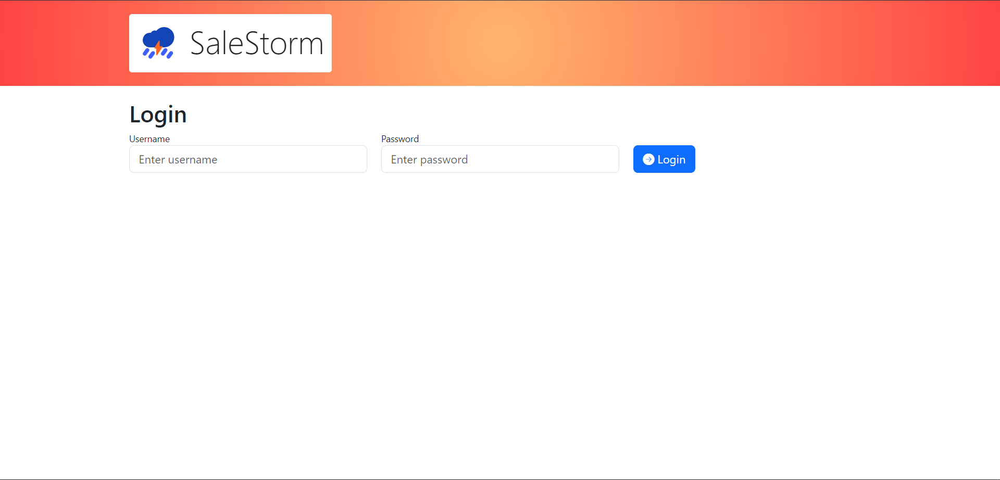
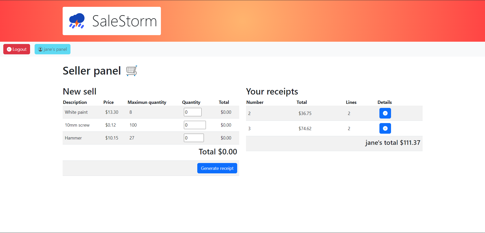
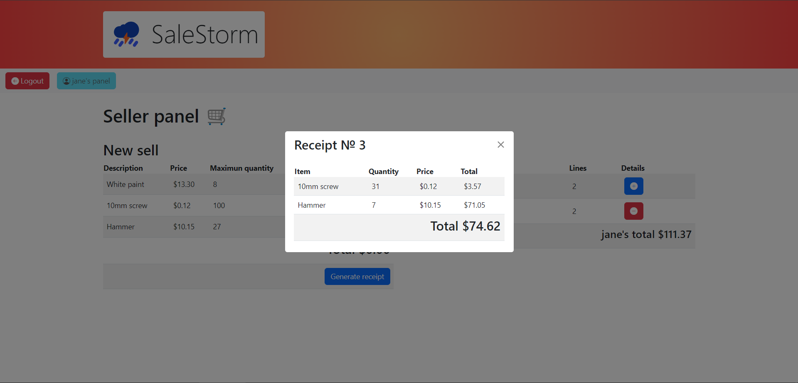
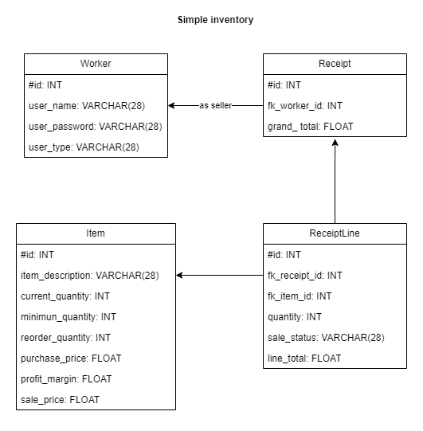
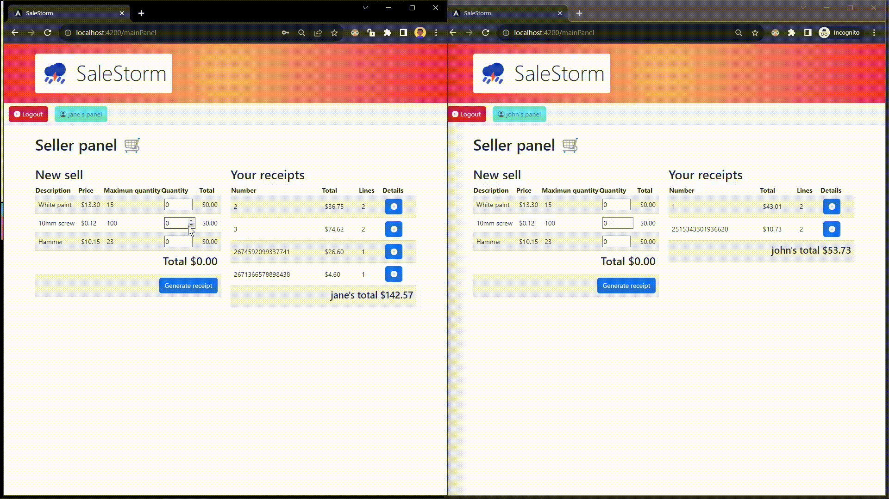

# SaleStorm

## About

**SaleStorm** is an application that aims to demonstrate in a very general way the integration of Angular, Microsoft SQL Server (as a database), and an RPC-based SignalR API in .NET.

The application provides the functionality of managing a simple **real-time inventory** among all the "sellers" in the system, so that operations on the inventory (mainly sales) will be **immediately** reflected on all clients connected to the backend.

***

**SaleStorm** es una aplicación que tiene como objetivo demostrar de manera general la integración de Angular, Microsoft SQL Server (como base de datos) y un API basado en RPC con SignalR en .NET.

La aplicación proporciona la funcionalidad de gestionar un sencillo **inventario en tiempo real** entre todos los "vendedores" del sistema, de manera que las operaciones sobre el inventario (principalmente ventas) se reflejarán **inmediatamente** en todos los clientes conectados al backend.

## Development environments

- SQL Server 2019 and SQL Server Management Studio 19.1
- Microsoft Visual Studio Community 2022 (64-bit) Version 17.6.4

## Setup

1. Create a database in SQL Server named `INVENTORY`
2. Run the SQL script `SalesStormBackend/Database/script.sql` in SQL Server Management Studio to create the database and its tables. [How to run a script in SSMS](https://stackoverflow.com/questions/10261855/how-to-run-sql-script-using-sql-server-management-studios)
3. Change the connection credentials in the file `SalesStormBackend/Data/RelDatabase.cs` to match your SQL Server credentials.
4. Open the solution `SalesStormBackend/SalesStormBackend.sln` in Visual Studio and run the project.
5. Open the folder `SalesStormFrontend` in a terminal and run `npm install` to install the dependencies.
6. Run `ng serve -o` to start the Angular development server.

***

1. Crear una base de datos en SQL Server con el nombre `INVENTORY`.
2. Ejecutar el script SQL `SalesStormBackend/Database/script.sql` en SQL Server Management Studio para crear la base de datos y sus tablas. [Cómo ejecutar un script en SSMS](https://stackoverflow.com/questions/10261855/how-to-run-sql-script-using-sql-server-management-studios)
3. Cambiar las credenciales de conexión en el archivo `SalesStormBackend/Data/RelDatabase.cs` para que coincidan con las credenciales de SQL Server.
4. Abrir la solución `SalesStormBackend/SalesStormBackend.sln` en Visual Studio y ejecutar el proyecto.
5. Abrir la carpeta `SalesStormFrontend` en una terminal y ejecutar `npm install` para instalar las dependencias.
6. Ejecutar `ng serve -o` para iniciar el servidor de desarrollo de Angular.

## Gallery

### Login

### Dashboard

### Receipt details

### Database

### Real-time inventory feature demostration

